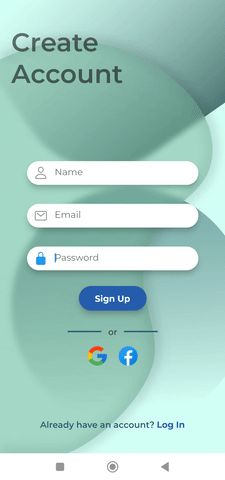

# FlutterFire Login Screen
:v: Meet the new LoginScreen :v:

## App Features.
- [Login screen](https://github.com/TarkanKara/Login_Screen/blob/master/screenshots/log%20in.jpg)
- [sign up screen](https://github.com/TarkanKara/Login_Screen/blob/master/screenshots/sign%20up.jpg)
- [firebase authentication](https://firebase.google.com/docs/auth/flutter/start)

**Screenshots:**
<p align="center">




</p>

**Packages used:**
- **[firebase_core: ^2.4.0](https://pub.dev/packages/firebase_core)**
- **[firebase_auth: ^4.2.3](https://pub.dev/packages/firebase_auth)**
- **[get: ^4.6.5](https://pub.dev/packages/get)**
- **[responsive_sizer: ^3.1.1](https://pub.dev/packages/responsive_sizer)**
- **[ionicons: ^0.2.1](https://pub.dev/packages/ionicons)**
- **[fluttertoast: ^8.1.2](https://pub.dev/packages/fluttertoast)**

## How to use
- To clone and run this application, you'll need [Git](https://git-scm.com/downloads) and [Flutter](https://flutter.dev/docs/get-started/install) installed on your computer. From your command line:
- [FlutterFire Installation](https://github.com/TarkanKara/Flutter_Firebase/tree/master/lib/flutterFire_1)


```
# Clone this repository
$ git clone https://github.com/TarkanKara/Login_Screen.git
```

```
# Install dependencies
$ flutter pub get
```

```
# Run the app
$ flutter run
```
:raising_hand: This project is just for fun, but if you have any crazy idea for this app feel free to contribute, or create request for the features. Any contributions you make are greatly appreciated.

# Contact me :memo:
<a href="https://www.linkedin.com/in/tarkan-kara-999326176/">

</a>
